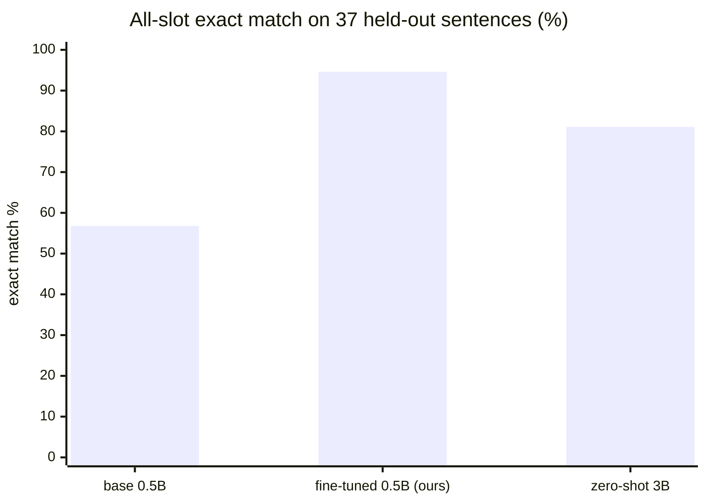
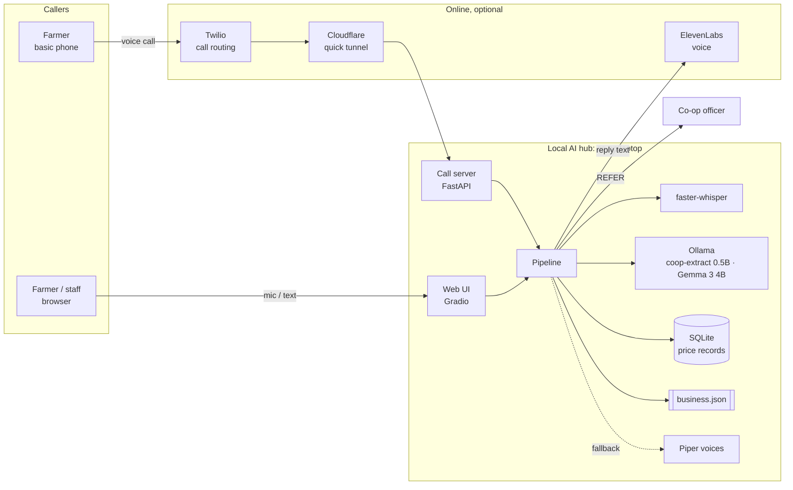
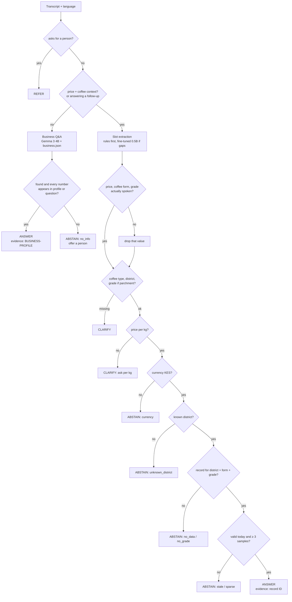
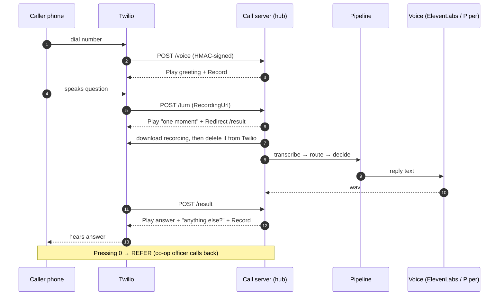
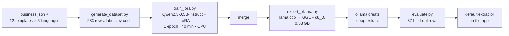

<p align="center">
  
</p>

<p align="center">
  
  
  
  
  
  
  
  
</p>

<p align="center">
  <b>Ask by voice or text, in English, Hindi, Swahili, Chinese or Korean.<br/>
  Get a grounded answer with its source, or an honest "I don't know" and a human.</b>
</p>

---

**Relay** is a **Small AI** voice assistant built for the *2026 Small AI for Development Hackathon* (agriculture track). It relays what a farmer says, in her own language, to the co-op's records and back, or to a person when the records can't answer. A laptop at a farmers' cooperative works as a local **AI hub**. Farmers call it from any phone or use a browser. It answers questions about the co-op and checks a buyer's coffee price offer against dated records. Speech recognition, understanding, the decision logic and the data all run on the hub with no internet. The AI never makes the farmer's decision, and every number it speaks comes from stored data, never from a model.

> [!IMPORTANT]
> All prices and the business profile are **synthetic demo data**. Nothing here is a live market price.

## Results at a glance

| 🎯 Fine-tuned exact match | ⚡ Seconds per sentence | 📦 Extractor size | 🌍 Languages | 📴 Internet needed for the core | ✅ Tests |
|:---:|:---:|:---:|:---:|:---:|:---:|
| **94.6%**<br/><sub>vs 81.1% for the 3B it replaced</sub> | **3.3 s**<br/><sub>vs 9.9 s, 3× faster</sub> | **0.53 GB**<br/><sub>vs 1.9 GB, 3.6× smaller</sub> | **5**<br/><sub>EN · SW · HI · ZH · KO</sub> | **none**<br/><sub>verified with network blocked</sub> | **29**<br/><sub>passing</sub> |

<p align="center">
  
</p>

<p align="center">
  
</p>

<details>
<summary><b>▶ Real conversations from the executed notebooks</b> (click to open)</summary>

<br/>

**Price check, English** (`ANSWER`, evidence `DEMO-NYR-PARCH-A`)
> 🧑‍🌾 *Buyer offered 105 for parchment coffee in Nyeri*<br/>
> 🤖 Please tell me the grade.<br/>
> 🧑‍🌾 *grade A*<br/>
> 🤖 Just so you know, this is demo data. According to Demo Co-op Nyeri's records from October 2, parchment coffee grade A in Nyeri is going for 120 shillings a kilo. So the 105 you were offered is 15 shillings below that. It's your call whether to sell, and do confirm the grade and moisture with your co-op.

**Price check, Swahili**
> 🤖 [DATA YA MAJARIBIO] Bei ya marejeleo ya kahawa ya parchment daraja A huko Nyeri ni KES 120 kwa kilo (Demo Co-op Nyeri, tarehe 2026-10-02, chanzo: SYNTHETIC DEMO FIXTURE). Bei ya mnunuzi ya 105 iko chini kwa KES 15 kuliko bei hii. Hii ni taarifa tu; uamuzi wa kuuza ni wako.

**Out-of-date record** (`ABSTAIN`, no number given)
> 🧑‍🌾 *Parchment grade A in Kiambu*<br/>
> 🤖 Just so you know, this is demo data. My latest record for Kiambu is from 2026-08-20 and is out of date, so I cannot give a current price. Please check with your co-op.

**Business question, Hindi** (Gemma 3 4B, grounded in `business.json`)
> 🧑‍🌾 *मुझे एडवांस पैसे मिल सकते हैं क्या?* (Can I get an advance?)<br/>
> 🤖 सदस्य अपने रिकॉर्ड किए गए डिलीवरी के विरुद्ध अधिकतम 30 प्रतिशत की अग्रिम राशि का अनुरोध कर सकते हैं। भुगतान मासिक, 15 तारीख को मोबाइल मनी के माध्यम से किया जाता है।

**Not in the profile** (`ABSTAIN`)
> 🧑‍🌾 *Do you sell tractors?*<br/>
> 🤖 Sorry, I don't have that information. I can ask an officer to call you back.

**Asks for a person** (`REFER`)
> 🧑‍🌾 *Can I talk to somebody please?*<br/>
> 🤖 With your permission, a co-op officer will call you back.

</details>

<details>
<summary><b>▶ What exactly was fine-tuned?</b></summary>

<br/>

| | |
|---|---|
| Task | One caller sentence → JSON slots `intent, quote, currency, unit, product_form, grade, district` |
| Base | `Qwen/Qwen2.5-0.5B-Instruct` (Apache-2.0, 494M parameters) |
| Data | 215 train / 37 held-out rows, **synthetic**, made from 12 templates in 5 languages with random prices, grades and districts. Labels are generated by code ([`generate_dataset.py`](finetune/generate_dataset.py)) |
| Method | LoRA r 16 / α 32 on all attention and MLP projections; loss on the JSON answer only |
| Compute | 1 epoch, 27 steps, **40.5 min on a laptop CPU**, no GPU |
| Loss | 0.072 at step 10 → 0.0067 at step 20; eval loss 0.0031 |
| Export | merged → llama.cpp GGUF **q8_0 (0.53 GB)** → `ollama create coop-extract` |
| Caveat | Eval rows share templates with training, so this shows task format and vocabulary, not real-caller accuracy |

Full details: [MODEL_CARD.md](finetune/MODEL_CARD.md) · reproduce: [finetune/README.md](finetune/README.md) · charts: [notebook 03](notebooks/03_finetuning.ipynb)

</details>



## Contents

- [Results at a glance](#results-at-a-glance)
- [Highlights](#highlights)
- [Hackathon readiness](#hackathon-readiness)
- [What we built](#what-we-built)
- [Notebooks](#notebooks)
- [Architecture](#architecture)
- [Decision contract](#decision-contract)
- [Safety guardrails](#safety-guardrails)
- [Repository layout](#repository-layout)
- [Quick start](#quick-start)
- [Phone channel](#phone-channel)
- [Configuration](#configuration)
- [Data](#data)
- [Models, footprint and latency](#models-footprint-and-latency)
- [Fine-tuning](#fine-tuning)
- [Testing and evaluation](#testing-and-evaluation)
- [Limitations](#limitations)
- [Roadmap](#roadmap)

## Highlights

| | |
|---|---|
| 🗣️ **Multilingual voice** | Whisper detects the language and transcribes it. Replies come back in the same language: English, Hindi, Swahili, Chinese, Korean |
| 📴 **Offline core** | Speech-to-text, LLMs (via Ollama), decision engine, SQLite data and Piper voices all run on a laptop CPU, with no network calls once the models are downloaded |
| ☎️ **Any phone** | An inbound call or a call-back runs through Twilio and a Cloudflare tunnel to the hub. No smartphone or data plan needed |
| 🧾 **Evidence or abstain** | A price answer needs a matching, in-date record with enough samples, and it carries an evidence ID. Anything else gets a clarifying question, an abstention or a hand-off to a person |
| 🏪 **Any business** | General questions are answered only from `data/business.json`. Swap the file to serve a shop, clinic or tour operator |
| 🔊 **Natural voice, safe fallback** | ElevenLabs when online, local Piper voices when not. Switching is automatic |

## Hackathon readiness

Every rule and deliverable in the brief, with where the evidence is. `python scripts/readiness_check.py` re-checks them automatically, with all non-local network traffic blocked, and writes [`docs/READINESS_REPORT.md`](docs/READINESS_REPORT.md).

| Brief requirement | How it is met | Evidence |
|---|---|---|
| Runs on a device the user already has | Farmers use the phone they own (a call) or a shared smartphone browser. The AI runs on the co-op's existing laptop | [Phone channel](#phone-channel) |
| Core feature works offline | STT, LLMs, engine, data and voice run locally | Readiness check runs the pipeline with internet blocked |
| Model files small enough to sideload | Largest model 3.3 GB; fine-tuned extractor about 0.5 GB (8-bit GGUF) | [Models](#models-footprint-and-latency), [MODEL_CARD](finetune/MODEL_CARD.md) |
| Named local language, and how it fares in a less-supported one | **Swahili**, plus Hindi, Chinese, Korean and English. Gĩkũyũ assessed honestly | [DATA_CARD §4](docs/DATA_CARD.md#4-named-local-language-and-a-less-supported-one) |
| A person makes the final call; uncertainty is flagged; no hallucination | `CLARIFY` / `ABSTAIN` / `REFER`, evidence IDs, number guards | [Safety guardrails](#safety-guardrails) |
| Cite data sources, license, size; label synthetic | Every dataset and model listed | [DATA_CARD §2](docs/DATA_CARD.md#2-data-we-build-with) |
| State what the data does not cover (scored) | Eight explicit gaps | [DATA_CARD §3](docs/DATA_CARD.md#3-what-this-data-does-not-cover) |
| Fine-tuning / quantisation (glossary) | LoRA fine-tune of Qwen2.5-0.5B on CPU → GGUF q8_0 → Ollama | [finetune/](finetune/) |
| Prototype + 2–5 min video with problem statement | Problem sentence and full video script | [SUBMISSION.md](docs/SUBMISSION.md) |

## What we built

Everything below runs in this repository, and every number was measured on the build laptop (Intel Core Ultra 5 CPU, no GPU).

| # | Step | Result |
|---|---|---|
| 1 | **Read the brief and designed for its rules** | One sector (agriculture), one decision (is this buyer's price fair?), offline core, named language, human in the loop. Original notes in [`docs/planning/`](docs/planning/) |
| 2 | **Deterministic decision engine** over dated SQLite records | Four states with mandatory evidence IDs; abstains on stale, sparse, mismatched or missing data |
| 3 | **Approved replies in 5 languages** | English, Hindi, Swahili, Chinese, Korean; numbers only from data |
| 4 | **Understanding layer**: rules first, local LLM for gaps | Multilingual keywords and digits, plus a JSON-schema LLM call and a guard that drops any price the caller didn't say |
| 5 | **Speech**: faster-whisper + Piper, ElevenLabs optional | Language ID was correct for all 5 languages in a round-trip test. Fully local fallback voice |
| 6 | **Grounded business Q&A** with Gemma 3 4B | Answers from `business.json`, blocks invented numbers, says "I don't know" otherwise. Tested in English, Hindi, Chinese, Swahili |
| 7 | **Web demo** (Gradio) | Shows transcript, extracted fields, decision state, evidence and internet status |
| 8 | **Phone channel**: FastAPI + Twilio + Cloudflare tunnel | HMAC-verified webhooks, hold-and-redirect while the hub thinks, press 0 for a person, call-back mode. A live call from a real phone reached the laptop and played the greeting; full turns were tested with signed simulated requests |
| 9 | **Fine-tuned our own model** | Qwen2.5-0.5B + LoRA on CPU → GGUF → Ollama `coop-extract`: **94.6%** exact match vs **81.1%** for the 3B it replaced, 3× faster, 3.6× smaller |
| 10 | **Data card, model card, submission pack** | Sources, licenses, sizes, synthetic labels, what the data does not cover, problem statement, video script |
| 11 | **Readiness check** | `scripts/readiness_check.py` re-verifies the brief's rules with the internet blocked → [`docs/READINESS_REPORT.md`](docs/READINESS_REPORT.md) |
| 12 | **Executed notebooks** | Five notebooks with real outputs walk through every layer → [`notebooks/`](notebooks/) |

## Notebooks

Executed, with their outputs saved, so they can be read on GitHub without running anything:

| Notebook | Shows |
|---|---|
| [`01_pipeline_walkthrough`](notebooks/01_pipeline_walkthrough.ipynb) | Evidence store → decision engine (all states) → replies in 5 languages → rules + LLM extraction → number guard → business Q&A → a full conversation |
| [`02_speech_offline`](notebooks/02_speech_offline.ipynb) | Piper voices with audio players, a Whisper round trip in 5 languages, and voice in → answer → voice out **with the internet blocked** |
| [`03_finetuning`](notebooks/03_finetuning.ipynb) | Dataset, LoRA training-loss curve, GGUF/Ollama export, base vs fine-tuned vs 3B charts |
| [`04_phone_channel`](notebooks/04_phone_channel.ipynb) | Simulated Twilio call: forged request rejected, greeting, recording, hold, answer audio, press 0 |
| [`05_readiness_check`](notebooks/05_readiness_check.ipynb) | The full readiness report against the brief |

## Architecture

<p align="center">
  
</p>

### System context



### Request routing



### Phone call sequence



## Decision contract

Every turn returns one of four states:

| State | When | Speaks a number? |
|---|---|---|
| `ANSWER` | A matching, in-date record with ≥ 3 samples, **or** a profile answer whose numbers all appear in the profile | Yes, from the record or profile only |
| `CLARIFY` | Coffee type, district, grade (for parchment) or a per-kg price is missing. Earlier answers are kept | No |
| `ABSTAIN` | Stale, sparse, no data, wrong grade, wrong currency, or not in the business profile | No |
| `REFER` | The caller asks for a person | No |

```json
{
  "state": "ANSWER",
  "intent": "PRICE_CHECK",
  "slots": {"quote": 105, "currency": "KES", "unit": "kg", "product_form": "parchment", "grade": "A", "district": "Nyeri"},
  "evidence_id": "DEMO-NYR-PARCH-A",
  "facts": {"reference": 120, "difference": -15, "observed_at": "2026-10-02", "sample_count": 12}
}
```

> *"Just so you know, this is demo data. According to Demo Co-op Nyeri's records from October 2, parchment coffee grade A in Nyeri is going for 120 shillings a kilo. So the 105 you were offered is 15 shillings below that. It's your call whether to sell, and do confirm the grade and moisture with your co-op."*

## Safety guardrails

- **Numbers come from data, never from a model.** Price replies are filled from the SQLite record and the caller's own words. If a business answer contains any number missing from both the profile and the question, it is replaced with "I don't have that information".
- **A price must actually be spoken.** If the LLM extracts a price whose digits are not in the transcript, the price is dropped.
- **So must the coffee form and grade.** Notebook 02 showed why. Whisper dropped "parchment", and the fine-tuned model filled it back in from habit. That was right by luck, so now any form or grade the caller didn't say is dropped, and the assistant asks instead.
- **Evidence ID on every price answer.** It is shown in the web UI so a reviewer can trace each answer to its record.
- **Abstain when unsure.** Out-of-date records, fewer than 3 samples, a mismatched grade or currency, or no record at all mean no number is given.
- **A human is always available.** Saying "officer", "somebody" and similar words, or pressing 0 on a call, hands over to a person.
- **Recordings are transient.** Each recording is deleted from Twilio right after download, and the local copy is deleted after transcription.
- **Twilio requests are verified.** Every webhook checks the HMAC-SHA1 signature, and unsigned requests get `403`. Audio file names are random UUIDs and checked against a strict pattern.
- **No secrets in code.** Credentials live only in environment variables (`scripts/set_secrets.ps1` stores them without echoing them).
- **The farmer decides.** Price replies say the information is for the farmer to weigh, not advice to sell.

## Repository layout

<details open>
<summary><b>Folder tree</b></summary>

```text
.
├── src/coop_assistant/
│   ├── config.py              # every setting, overridable by env var
│   ├── pipeline.py            # Assistant: routing, conversation state
│   ├── core/
│   │   ├── decision.py        # deterministic price engine (ANSWER/CLARIFY/ABSTAIN/REFER)
│   │   ├── responses.py       # approved reply templates, 5 languages
│   │   └── store.py           # SQLite price records (synthetic demo fixtures)
│   ├── nlu/
│   │   ├── extract.py         # rules + Qwen2.5 slot extraction, normalisation, number guard
│   │   └── business_qa.py     # Gemma 3 Q&A grounded in business.json
│   ├── speech/
│   │   └── voice.py           # faster-whisper STT; ElevenLabs → Piper TTS
│   └── apps/
│       ├── web_ui.py          # Gradio demo screen
│       ├── call_server.py     # FastAPI + Twilio webhooks
│       └── call_me.py         # call-back mode
├── data/business.json         # swappable business profile (demo)
├── finetune/
│   ├── generate_dataset.py    # synthetic multilingual SFT data, labels made by code
│   ├── train_lora.py          # LoRA SFT (CPU or GPU), prompt/completion loss
│   ├── export_ollama.py       # merged model → GGUF (llama.cpp) → ollama create
│   ├── evaluate.py            # exact-match / grounding metrics against Ollama models
│   ├── configs/ data/ results/
│   └── MODEL_CARD.md
├── notebooks/                 # 5 executed walkthroughs (pipeline, speech, fine-tune, phone, readiness)
├── tests/test_core.py         # 29 unit tests
├── scripts/
│   ├── readiness_check.py     # brief rules + deliverables, offline-enforced
│   ├── download_models.py     # one-time model download
│   ├── start_call.ps1         # tunnel + Twilio webhook + call server
│   └── set_secrets.ps1        # store credentials without echoing them
├── docs/
│   ├── DATA_CARD.md           # sources, licenses, sizes, what the data does not cover
│   ├── SUBMISSION.md          # problem statement + video script
│   ├── READINESS_REPORT.md    # generated by readiness_check.py
│   └── planning/              # original design notes and knowledge graph
├── assets/                    # animated SVGs used in this README
└── tools/extract_pdf_text.py  # dependency-free PDF text extractor
```

</details>

## Quick start

**Prerequisites:** Python 3.10+ and [Ollama](https://ollama.com). About 7 GB of disk for the models. No GPU needed.

```bash
git clone https://github.com/Akashsinghpanwar/Hacknation07-team-spa-.git
cd Hacknation07-team-spa-
pip install -e .

python scripts/download_models.py     # Whisper small, 5 Piper voices, qwen2.5:3b, gemma3:4b
python -m unittest discover -s tests  # 29 tests
python -m coop_assistant.apps.web_ui  # http://127.0.0.1:7860
```

Then **turn Wi-Fi off** and ask:

| Try | Expect |
|---|---|
| `Buyer offered 105 shillings per kg for grade A parchment coffee in Nyeri` | `ANSWER`: 120 reference, 15 below |
| `Parchment grade A in Kiambu` | `ABSTAIN`: record out of date |
| `Parchment grade A in Kirinyaga` | `ABSTAIN`: only 1 sample |
| `Buyer offered 105 for parchment in Nyeri` → `grade A` | `CLARIFY`, then `ANSWER` |
| `मुझे एडवांस पैसे मिल सकते हैं क्या?` | `ANSWER` in Hindi from the business profile |
| `Do you sell tractors?` | `ABSTAIN`: not in the profile |
| `Can I talk to somebody please?` | `REFER` |

## Phone channel

The phone channel needs internet: Twilio carries the call and a Cloudflare quick tunnel exposes the hub. The AI itself still runs on the hub.

```powershell
# once: store credentials (typed, never echoed)
powershell -ExecutionPolicy Bypass -File scripts\set_secrets.ps1

# every session: tunnel + webhook + server
powershell -ExecutionPolicy Bypass -File scripts\start_call.ps1 -Number +1XXXXXXXXXX
```

`start_call.ps1` starts `cloudflared` (or `ngrok`) and reads the public URL. It points the Twilio number's voice webhook to `<url>/voice` through the Twilio API, then runs the server. For call-back mode, where the caller pays nothing:

```bash
python -m coop_assistant.apps.call_me --url <public_url> --to +<caller> --from +<twilio_number>
```

> [!NOTE]
> New Twilio **trial** accounts can only run Twilio's own demo webhooks. A custom webhook like this one needs an upgraded account.

## Configuration

<details>
<summary><b>▶ All environment variables</b> (every setting has a working default)</summary>

<br/>

| Variable | Default | Purpose |
|---|---|---|
| `MODEL_DIR` | `%LOCALAPPDATA%/coffee-price-ai` | Whisper models, Piper voices, SQLite file |
| `BUSINESS_FILE` | `data/business.json` | Business profile used for Q&A |
| `OLLAMA_URL` | `http://localhost:11434` | Ollama endpoint |
| `OLLAMA_MODEL` | `coop-extract` | Slot extraction model (our fine-tune) |
| `OLLAMA_FALLBACK_MODEL` | `qwen2.5:3b` | Used automatically if `OLLAMA_MODEL` is not installed |
| `QA_MODEL` | `gemma3:4b` | Business Q&A model |
| `WHISPER_SIZE` | `small` | `large-v3-turbo` is more accurate but about 3× slower |
| `ELEVENLABS_API_KEY` | unset | Turns on cloud voice. Without it, Piper only |
| `ELEVENLABS_MODEL` | `eleven_multilingual_v2` | ElevenLabs model |
| `ELEVENLABS_VOICE_ID` | `JBFqnCBsd6RMkjVDRZzb` | ElevenLabs voice |
| `ELEVENLABS_LANGS` | `en,hi,zh,ko` | Languages sent to ElevenLabs (Swahili stays local) |
| `TWILIO_ACCOUNT_SID` / `TWILIO_AUTH_TOKEN` | unset | Phone channel |
| `TWILIO_PHONE_NUMBER` | unset | Number whose webhook is set on start |
| `PUBLIC_URL` | set by `start_call.ps1` | Public tunnel URL |

</details>

## Data

**Price record** (`core/store.py`, re-seeded on start so the demo dates stay current):

```text
id, country, district, market, crop, product_form, grade, currency, unit,
observed_at, valid_until, price_value, sample_count,
source_name, source_contact, usage_permission, imported_at
```

| Record | District | Form / grade | KES/kg | Samples | Outcome |
|---|---|---|---|---|---|
| `DEMO-NYR-PARCH-A` | Nyeri | Parchment A | 120 | 12 | `ANSWER` |
| `DEMO-NYR-CHERRY` | Nyeri | Cherry | 65 | 9 | `ANSWER` |
| `DEMO-KMB-PARCH-A-STALE` | Kiambu | Parchment A | 110 | 8 | `ABSTAIN` (expired) |
| `DEMO-KRN-PARCH-A-SPARSE` | Kirinyaga | Parchment A | 125 | 1 | `ABSTAIN` (sparse) |
| none | Murang'a | | | | `ABSTAIN` (no data) |

**Business profile** (`data/business.json`) covers hours, coffee intake, payments, services, membership, contact and policies. It is plain JSON, so any business can replace it without code changes.

## Models, footprint and latency

| Component | Model | Size on disk | Measured per turn (Intel Core Ultra 5 CPU, no GPU) |
|---|---|---|---|
| Speech-to-text + language ID | faster-whisper `small`, int8 | 0.75 GB with all 5 voices | 4–6 s |
| Slot extraction | rules, then **`coop-extract`** (our fine-tuned Qwen2.5-0.5B, GGUF q8_0) only if fields are missing; `qwen2.5:3b` as fallback | 0.53 GB | ~0 s with rules, ~3.3 s with the LLM |
| Business Q&A | `gemma3:4b` | 3.3 GB | 10–35 s |
| Decision + templates | Python + SQLite | < 1 MB | instant |
| Text-to-speech | Piper `medium` voices / ElevenLabs | included above | ~3 s for Piper, network-bound for ElevenLabs |

Model choices:
- **Q&A:** `qwen2.5:3b` answered Hindi, Swahili and Chinese business questions poorly ("not found", or broken Swahili). `gemma3:4b` answered them correctly at about twice the latency, so it handles Q&A.
- **Extraction:** our fine-tuned 0.5B model beat the zero-shot 3B on accuracy, speed and size, so it replaced it (see below).

## Fine-tuning

The brief's glossary names **fine-tuning** and **quantisation**. We ran both, end to end, on a laptop CPU with no GPU:



| Model | Size | Intent | All-slot exact match | s / sentence |
|---|---|---|---|---|
| `qwen2.5:0.5b`, same base, no fine-tune | 0.40 GB | 94.6% | 56.8% | 3.4 |
| **`coop-extract`, fine-tuned** | **0.53 GB** | **97.3%** | **94.6%** | **3.3** |
| `qwen2.5:3b`, zero-shot, previous default | 1.9 GB | 100% | 81.1% | 9.9 |

**Fine-tuning took the 0.5B base from 56.8% to 94.6% exact match.** That beats the 3B it replaced, runs 3× faster per sentence, and is 3.6× smaller on disk. The 3B's misses were all currencies or units the caller never said, plus the Swahili *matunda ya kahawa* (coffee cherries). The fine-tune fixed the Swahili word and almost all of the made-up details.

> [!CAUTION]
> The eval rows come from the same templates as the training rows, so this measures task format and vocabulary, not accuracy on real callers. The training data is synthetic. See [MODEL_CARD.md](finetune/MODEL_CARD.md) and [DATA_CARD.md](docs/DATA_CARD.md).

Reproduce it with:

```bash
pip install -e ".[finetune]"
python finetune/generate_dataset.py
python finetune/train_lora.py --config finetune/configs/qwen2.5-0.5b-extract-cpu.json
python finetune/export_ollama.py --merged finetune/outputs/qwen2.5-0.5b-extract-lora/merged --name coop-extract
python finetune/evaluate.py --task extract --extract-model coop-extract
```

## Testing and evaluation

```bash
python -m unittest discover -s tests -v
```

The 29 tests cover:
- every decision state
- the number guard on extraction and on Q&A
- the LLM being unable to add a coffee form or grade the caller never said
- stripping leaked model control tokens
- Hindi spoken grade letters (ग्रेड ए → A)
- unknown units
- all 5 languages producing every outcome with exact numbers
- two-turn clarification
- a new question clearing a pending clarification
- routing (a seedling price question is not a coffee price check)
- referral

The phone flow was also tested end to end with HMAC-signed simulated Twilio requests: greeting → recording → hold → answer → follow-up → press 0.

## Limitations

- Speech accuracy varies by language. Swahili, Chinese and Korean need testing with real speakers. In one synthetic test Whisper heard "105" as "150" in Chinese, so every price reply repeats the offer it heard.
- Hindi, Swahili, Chinese and Korean reply templates need review by native speakers. Gemma's Swahili answers are understandable but not polished.
- Business Q&A takes 10–35 s per turn on CPU. The caller hears a hold prompt while it runs.
- The phone channel needs internet. The hub is local edge inference, not inference on the farmer's own handset.
- All data is synthetic. A pilot needs a dated price feed that a cooperative or market partner allows us to use.

## Roadmap

- [ ] Real price feed from a partner cooperative, with usage permission
- [ ] Native-speaker review of templates; consented real-caller test set split by gender and accent
- [x] Fine-tune a small extractor and switch to it (done: `coop-extract`, 0.5B)
- [ ] Re-train it on consented real transcripts, more epochs, GPU; add Q&A fine-tuning in all five languages
- [ ] Local SIM/GSM gateway + Asterisk, so calls need no internet while mobile voice coverage exists
- [ ] Android on-device build (whisper.cpp + llama.cpp) for shared household smartphones
- [ ] Crop-advice questions routed to extension officers

## Docs

- [`docs/planning/HANDOVER.md`](docs/planning/HANDOVER.md): original design decisions, cost model, acceptance tests
- [`docs/planning/KNOWLEDGE_GRAPH.md`](docs/planning/KNOWLEDGE_GRAPH.md) and [`knowledge_graph.json`](docs/planning/knowledge_graph.json): brief requirements mapped to design
- [`docs/ARCHITECTURE_PROMPT.md`](docs/ARCHITECTURE_PROMPT.md): prompt for generating the architecture PDF and illustrations

<p align="center"><sub>Built for the 2026 Small AI for Development Hackathon · all data shown is synthetic</sub></p>
