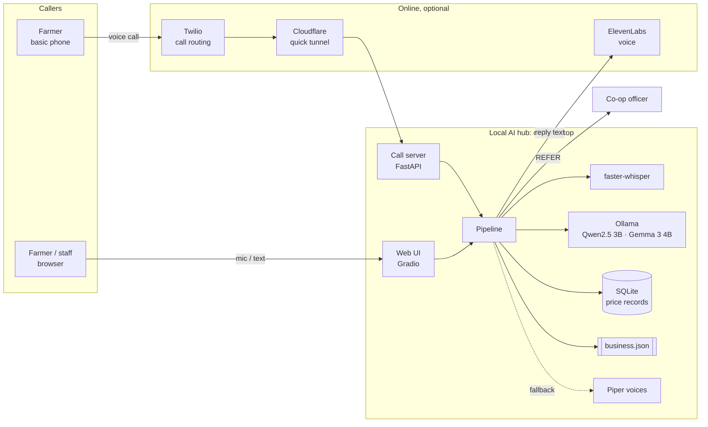
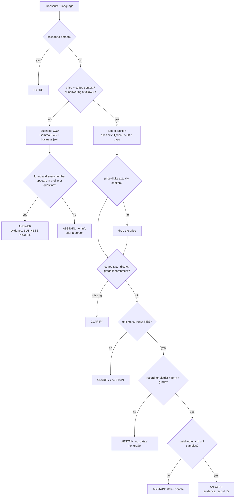
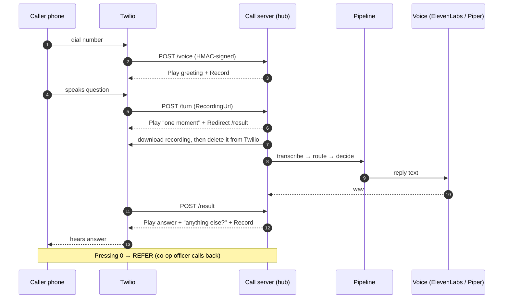

<p align="center">
  
</p>

<p align="center">
  
  
  
  
  
  
  
</p>

<p align="center">
  <b>Ask by voice or text, in English, Hindi, Swahili, Chinese or Korean.<br/>
  Get a grounded answer with its source, or an honest "I don't know" and a human.</b>
</p>

---

A **Small AI** voice assistant built for the *2026 Small AI for Development Hackathon* (agriculture track). A laptop at a farmers' cooperative works as a local **AI hub**. Farmers call it from any phone or use a browser. It answers questions about the co-op and checks a buyer's coffee price offer against dated records. Speech recognition, understanding, the decision logic and the data all run on the hub with no internet. The AI never makes the farmer's decision, and every number it speaks comes from stored data, never from a model.

> [!IMPORTANT]
> All prices and the business profile are **synthetic demo data**. Nothing here is a live market price.

## Contents

- [Highlights](#highlights)
- [Architecture](#architecture)
- [Decision contract](#decision-contract)
- [Safety guardrails](#safety-guardrails)
- [Repository layout](#repository-layout)
- [Quick start](#quick-start)
- [Phone channel](#phone-channel)
- [Configuration](#configuration)
- [Data](#data)
- [Models, footprint and latency](#models-footprint-and-latency)
- [Fine-tuning](#fine-tuning)
- [Testing and evaluation](#testing-and-evaluation)
- [Limitations](#limitations)
- [Roadmap](#roadmap)

## Highlights

| | |
|---|---|
| 🗣️ **Multilingual voice** | Whisper detects the language and transcribes it. Replies come back in the same language: English, Hindi, Swahili, Chinese, Korean |
| 📴 **Offline core** | Speech-to-text, LLMs (via Ollama), decision engine, SQLite data and Piper voices all run on a laptop CPU, with no network calls once the models are downloaded |
| ☎️ **Any phone** | An inbound call or a call-back runs through Twilio and a Cloudflare tunnel to the hub. No smartphone or data plan needed |
| 🧾 **Evidence or abstain** | A price answer needs a matching, in-date record with enough samples, and it carries an evidence ID. Anything else gets a clarifying question, an abstention or a hand-off to a person |
| 🏪 **Any business** | General questions are answered only from `data/business.json`. Swap the file to serve a shop, clinic or tour operator |
| 🔊 **Natural voice, safe fallback** | ElevenLabs when online, local Piper voices when not. Switching is automatic |

## Architecture

<p align="center">
  
</p>

### System context



### Request routing



### Phone call sequence



## Decision contract

Every turn returns one of four states:

| State | When | Speaks a number? |
|---|---|---|
| `ANSWER` | A matching, in-date record with ≥ 3 samples, **or** a profile answer whose numbers all appear in the profile | Yes, from the record or profile only |
| `CLARIFY` | Coffee type, district, grade (for parchment) or a per-kg price is missing. Earlier answers are kept | No |
| `ABSTAIN` | Stale, sparse, no data, wrong grade, wrong currency, or not in the business profile | No |
| `REFER` | The caller asks for a person | No |

```json
{
  "state": "ANSWER",
  "intent": "PRICE_CHECK",
  "slots": {"quote": 105, "currency": "KES", "unit": "kg", "product_form": "parchment", "grade": "A", "district": "Nyeri"},
  "evidence_id": "DEMO-NYR-PARCH-A",
  "facts": {"reference": 120, "difference": -15, "observed_at": "2026-10-02", "sample_count": 12}
}
```

> *"Just so you know, this is demo data. According to Demo Co-op Nyeri's records from October 2, parchment coffee grade A in Nyeri is going for 120 shillings a kilo. So the 105 you were offered is 15 shillings below that. It's your call whether to sell, and do confirm the grade and moisture with your co-op."*

## Safety guardrails

- **Numbers come from data, never from a model.** Price replies are filled from the SQLite record and the caller's own words. If a business answer contains any number missing from both the profile and the question, it is replaced with "I don't have that information".
- **A price must actually be spoken.** If the LLM extracts a price whose digits are not in the transcript, the price is dropped.
- **Evidence ID on every price answer.** It is shown in the web UI so a reviewer can trace each answer to its record.
- **Abstain when unsure.** Out-of-date records, fewer than 3 samples, a mismatched grade or currency, or no record at all mean no number is given.
- **A human is always available.** Saying "officer", "somebody" and similar words, or pressing 0 on a call, hands over to a person.
- **Recordings are transient.** Each recording is deleted from Twilio right after download, and the local copy is deleted after transcription.
- **Twilio requests are verified.** Every webhook checks the HMAC-SHA1 signature, and unsigned requests get `403`. Audio file names are random UUIDs and checked against a strict pattern.
- **No secrets in code.** Credentials live only in environment variables (`scripts/set_secrets.ps1` stores them without echoing them).
- **The farmer decides.** Price replies say the information is for the farmer to weigh, not advice to sell.

## Repository layout

```text
.
├── src/coop_assistant/
│   ├── config.py              # every setting, overridable by env var
│   ├── pipeline.py            # Assistant: routing, conversation state
│   ├── core/
│   │   ├── decision.py        # deterministic price engine (ANSWER/CLARIFY/ABSTAIN/REFER)
│   │   ├── responses.py       # approved reply templates, 5 languages
│   │   └── store.py           # SQLite price records (synthetic demo fixtures)
│   ├── nlu/
│   │   ├── extract.py         # rules + Qwen2.5 slot extraction, normalisation, number guard
│   │   └── business_qa.py     # Gemma 3 Q&A grounded in business.json
│   ├── speech/
│   │   └── voice.py           # faster-whisper STT; ElevenLabs → Piper TTS
│   └── apps/
│       ├── web_ui.py          # Gradio demo screen
│       ├── call_server.py     # FastAPI + Twilio webhooks
│       └── call_me.py         # call-back mode
├── data/business.json         # swappable business profile (demo)
├── finetune/                  # dataset generator, LoRA training, evaluation, Ollama export
├── tests/test_core.py         # 26 unit tests
├── scripts/                   # start_call.ps1, set_secrets.ps1, download_models.py
├── docs/                      # planning notes, knowledge graph, architecture-doc prompt
├── assets/                    # animated SVGs used in this README
└── tools/extract_pdf_text.py  # dependency-free PDF text extractor
```

## Quick start

**Prerequisites:** Python 3.10+ and [Ollama](https://ollama.com). About 7 GB of disk for the models. No GPU needed.

```bash
git clone https://github.com/Akashsinghpanwar/Hacknation07-team-spa-.git
cd Hacknation07-team-spa-
pip install -e .

python scripts/download_models.py     # Whisper small, 5 Piper voices, qwen2.5:3b, gemma3:4b
python -m unittest discover -s tests  # 26 tests
python -m coop_assistant.apps.web_ui  # http://127.0.0.1:7860
```

Then **turn Wi-Fi off** and ask:

| Try | Expect |
|---|---|
| `Buyer offered 105 shillings per kg for grade A parchment coffee in Nyeri` | `ANSWER`: 120 reference, 15 below |
| `Parchment grade A in Kiambu` | `ABSTAIN`: record out of date |
| `Parchment grade A in Kirinyaga` | `ABSTAIN`: only 1 sample |
| `Buyer offered 105 for parchment in Nyeri` → `grade A` | `CLARIFY`, then `ANSWER` |
| `मुझे एडवांस पैसे मिल सकते हैं क्या?` | `ANSWER` in Hindi from the business profile |
| `Do you sell tractors?` | `ABSTAIN`: not in the profile |
| `Can I talk to somebody please?` | `REFER` |

## Phone channel

The phone channel needs internet: Twilio carries the call and a Cloudflare quick tunnel exposes the hub. The AI itself still runs on the hub.

```powershell
# once: store credentials (typed, never echoed)
powershell -ExecutionPolicy Bypass -File scripts\set_secrets.ps1

# every session: tunnel + webhook + server
powershell -ExecutionPolicy Bypass -File scripts\start_call.ps1 -Number +1XXXXXXXXXX
```

`start_call.ps1` starts `cloudflared` (or `ngrok`) and reads the public URL. It points the Twilio number's voice webhook to `<url>/voice` through the Twilio API, then runs the server. For call-back mode, where the caller pays nothing:

```bash
python -m coop_assistant.apps.call_me --url <public_url> --to +<caller> --from +<twilio_number>
```

> [!NOTE]
> New Twilio **trial** accounts can only run Twilio's own demo webhooks. A custom webhook like this one needs an upgraded account.

## Configuration

| Variable | Default | Purpose |
|---|---|---|
| `MODEL_DIR` | `%LOCALAPPDATA%/coffee-price-ai` | Whisper models, Piper voices, SQLite file |
| `BUSINESS_FILE` | `data/business.json` | Business profile used for Q&A |
| `OLLAMA_URL` | `http://localhost:11434` | Ollama endpoint |
| `OLLAMA_MODEL` | `qwen2.5:3b` | Slot extraction model |
| `QA_MODEL` | `gemma3:4b` | Business Q&A model |
| `WHISPER_SIZE` | `small` | `large-v3-turbo` is more accurate but about 3× slower |
| `ELEVENLABS_API_KEY` | unset | Turns on cloud voice. Without it, Piper only |
| `ELEVENLABS_MODEL` | `eleven_multilingual_v2` | ElevenLabs model |
| `ELEVENLABS_VOICE_ID` | `JBFqnCBsd6RMkjVDRZzb` | ElevenLabs voice |
| `ELEVENLABS_LANGS` | `en,hi,zh,ko` | Languages sent to ElevenLabs (Swahili stays local) |
| `TWILIO_ACCOUNT_SID` / `TWILIO_AUTH_TOKEN` | unset | Phone channel |
| `TWILIO_PHONE_NUMBER` | unset | Number whose webhook is set on start |
| `PUBLIC_URL` | set by `start_call.ps1` | Public tunnel URL |

## Data

**Price record** (`core/store.py`, re-seeded on start so the demo dates stay current):

```text
id, country, district, market, crop, product_form, grade, currency, unit,
observed_at, valid_until, price_value, sample_count,
source_name, source_contact, usage_permission, imported_at
```

| Record | District | Form / grade | KES/kg | Samples | Outcome |
|---|---|---|---|---|---|
| `DEMO-NYR-PARCH-A` | Nyeri | Parchment A | 120 | 12 | `ANSWER` |
| `DEMO-NYR-CHERRY` | Nyeri | Cherry | 65 | 9 | `ANSWER` |
| `DEMO-KMB-PARCH-A-STALE` | Kiambu | Parchment A | 110 | 8 | `ABSTAIN` (expired) |
| `DEMO-KRN-PARCH-A-SPARSE` | Kirinyaga | Parchment A | 125 | 1 | `ABSTAIN` (sparse) |
| none | Murang'a | | | | `ABSTAIN` (no data) |

**Business profile** (`data/business.json`) covers hours, coffee intake, payments, services, membership, contact and policies. It is plain JSON, so any business can replace it without code changes.

## Models, footprint and latency

| Component | Model | Size on disk | Measured per turn (Intel Core Ultra 5 CPU, no GPU) |
|---|---|---|---|
| Speech-to-text + language ID | faster-whisper `small`, int8 | 0.75 GB with all 5 voices | 4–6 s |
| Slot extraction | rules, then `qwen2.5:3b` only if fields are missing | 1.9 GB | ~0 s with rules, 5–10 s with the LLM |
| Business Q&A | `gemma3:4b` | 3.3 GB | 5–15 s |
| Decision + templates | Python + SQLite | < 1 MB | instant |
| Text-to-speech | Piper `medium` voices / ElevenLabs | included above | ~3 s for Piper, network-bound for ElevenLabs |

Model choice: `qwen2.5:3b` answered Hindi, Swahili and Chinese business questions poorly ("not found", or broken Swahili). `gemma3:4b` answered them correctly at about twice the latency, so it handles Q&A. Extraction stays on the faster Qwen.

## Fine-tuning

[`finetune/`](finetune/) holds a reproducible path to smaller, faster task-specific models:

```bash
python finetune/generate_dataset.py                                    # 240 train / 43 eval, labels made by code
python finetune/evaluate.py --extract-model qwen2.5:3b --qa-model gemma3:4b   # baseline
python finetune/train_lora.py --config finetune/configs/qwen2.5-1.5b-lora.json  # GPU
```

**Baseline (zero-shot, 43 held-out rows):** extraction intent accuracy is **100%** and all-slot exact match is **81.1%**. Every miss is either a currency or unit the caller never said, or Swahili *matunda ya kahawa* (coffee cherries) not recognised. Q&A found/not-found accuracy and grounding are both **100%**.

The LoRA script has **not been run yet** (no GPU on the build machine). See [finetune/README.md](finetune/README.md) for the hyper-parameters and the GGUF/Ollama export.

## Testing and evaluation

```bash
python -m unittest discover -s tests -v
```

The 26 tests cover:
- every decision state
- the number guard on extraction and on Q&A
- unknown units
- all 5 languages producing every outcome with exact numbers
- two-turn clarification
- a new question clearing a pending clarification
- routing (a seedling price question is not a coffee price check)
- referral

The phone flow was also tested end to end with HMAC-signed simulated Twilio requests: greeting → recording → hold → answer → follow-up → press 0.

## Limitations

- Speech accuracy varies by language. Swahili, Chinese and Korean need testing with real speakers. In one synthetic test Whisper heard "105" as "150" in Chinese, so every price reply repeats the offer it heard.
- Hindi, Swahili, Chinese and Korean reply templates need review by native speakers. Gemma's Swahili answers are understandable but not polished.
- Business Q&A takes 5–15 s per turn on CPU. The caller hears a hold prompt while it runs.
- The phone channel needs internet. The hub is local edge inference, not inference on the farmer's own handset.
- All data is synthetic. A pilot needs a dated price feed that a cooperative or market partner allows us to use.

## Roadmap

- [ ] Real price feed from a partner cooperative, with usage permission
- [ ] Native-speaker review of templates; consented real-caller test set split by gender and accent
- [ ] Run the LoRA fine-tune and switch to a 1–1.5B model if it matches accuracy
- [ ] Local SIM/GSM gateway + Asterisk, so calls need no internet while mobile voice coverage exists
- [ ] Android on-device build (whisper.cpp + llama.cpp) for shared household smartphones
- [ ] Crop-advice questions routed to extension officers

## Docs

- [`docs/planning/HANDOVER.md`](docs/planning/HANDOVER.md): original design decisions, cost model, acceptance tests
- [`docs/planning/KNOWLEDGE_GRAPH.md`](docs/planning/KNOWLEDGE_GRAPH.md) and [`knowledge_graph.json`](docs/planning/knowledge_graph.json): brief requirements mapped to design
- [`docs/ARCHITECTURE_PROMPT.md`](docs/ARCHITECTURE_PROMPT.md): prompt for generating the architecture PDF and illustrations

<p align="center"><sub>Built for the 2026 Small AI for Development Hackathon · all data shown is synthetic</sub></p>
