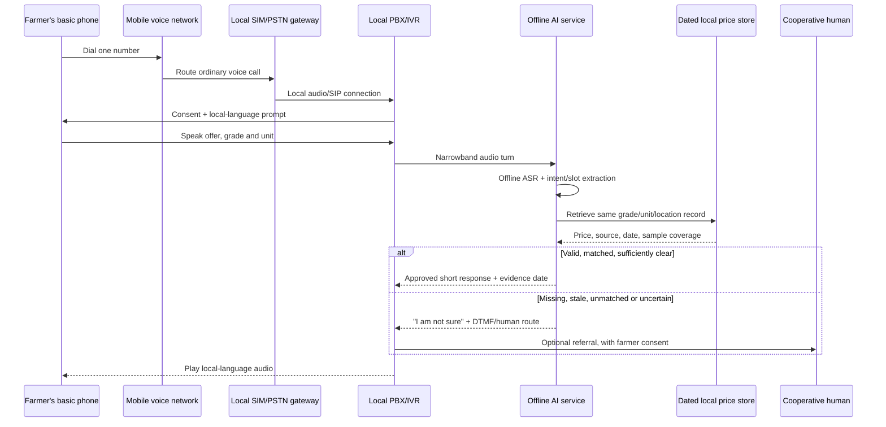

# Handover: one-number, low-cost Small AI for coffee farmers

> Planning document written on 3 October 2026, before the prototype existed. For what was actually built, see the [project README](../../README.md).

**Status:** Architecture and delivery plan. **Date:** 3 October 2026 (Europe/London). **Source brief:** the hackathon concept note PDF, marked *Official Use Only* and therefore not included in this repository. **Evidence map:** [KNOWLEDGE_GRAPH.md](KNOWLEDGE_GRAPH.md) and [knowledge_graph.json](knowledge_graph.json).

## 1. Decision in one paragraph

Build a **narrow agriculture assistant** for Noor's coffee price decision. A farmer can speak a buyer's offer in a named local language and hear a dated, grade-matched price reference, its source, and an uncertainty warning. The AI recognizes natural speech and extracts price, unit, grade and location; a deterministic rule retrieves only approved facts and composes a short response. It never decides to sell. Run the core offline on the **existing household smartphone** for the hackathon rule. Offer a **separate Nokia/feature-phone access path** through one local phone number that terminates on a SIM/PSTN gateway and a local edge computer. This uses no paid cloud AI inference, but still has telecom, hardware and maintenance costs.

**Working assumptions to replace before claiming a field pilot:** agriculture sector; Hindi for the first sample interaction if the pilot is in India; district, carrier, exact handset and local coffee price source are not yet known. Noor/Ondera are fictional in the brief (PDF pp. 5–6). If the team chooses another country, replace Hindi and every location-specific fixture. Do not present the sample data as a live price.

## 2. What the PDF actually requires

The hackathon asks for **one sector** (health, agriculture or tourism), a working AI tool, and proof that it works (PDF pp. 3, 6–7). Its rules say the tool runs on a device the user already has, the core feature works offline, model files are small enough to sideload/transfer over weak connectivity, and at least one interaction is in a **named local language** (p. 7). It requires human oversight, an uncertainty path, and source attribution (pp. 7–8, 11). A prototype and **2–5 minute video** are mandatory; the video must show the problem, AI value, guardrails, and the journey (p. 10).

The glossary defines offline/on-device AI as running on the user's own phone or hardware **with no connection** (p. 11). A live remote call cannot satisfy that strict reading. The one-number line must be positioned as an access extension, while the offline smartphone demonstration is the closest submission core. The phone is shared and only intermittently available to Noor (p. 5), so even that path has an access/ownership risk to explain. **No single live one-number architecture satisfies all of the Nokia-only, no-connection, on-device requirements at once.** If judges insist every channel must be on-device/offline, the live Nokia channel does not qualify.

## 3. Nokia question: exactly where the AI runs

| Option | Nokia can use it? | Works with no internet? | Works with no mobile voice signal? | Fits strict PDF on-device rule? | Decision |
|---|---:|---:|---:|---:|---|
| AI wholly inside a typical basic Nokia | No practical speech model/runtime for this design | N/A | N/A | In theory only if the exact device can run it | Reject until an exact compatible model/device is proved |
| Cloud voice provider + cloud AI | Yes | No | No | No | Avoid for the intended offline/cost claim |
| **Local SIM gateway + edge computer** | **Yes, by normal voice call** | **Yes, after data/model preload** | **No** | **No: AI is at the gateway** | Use as field access channel |
| **Offline app on existing household smartphone** | Nokia itself: no | **Yes** | **Yes** | Potentially; shared and intermittent access must be disclosed | Use as hackathon core |

The local call path needs a mobile voice network, a reachable number, power at the gateway, and an operator plan. An ordinary third-party Android app is a poor substitute for a gateway because [Android restricts capturing call audio to privileged apps](https://developer.android.com/media/platform/sharing-audio-input). A hosted voice service such as Twilio [requires a public internet-addressable webhook](https://www.twilio.com/docs/voice/tutorials/how-to-respond-to-incoming-phone-calls), so it is not the offline call path. These are implementation constraints, not just pricing preferences.

## 4. Recommended architecture



**Gateway:** An authorized local SIM/PSTN-to-SIP gateway with the pilot number, linked by LAN/USB to a laptop or small computer. Check whether the chosen carrier permits this connection and whether inbound calls/number rental are available; country rules differ. One SIM normally gives one simultaneous voice call, so size concurrency from real traffic. The gateway and PC can operate without internet once provisioned. **Asterisk** is a plausible local PBX: its official documentation covers [DTMF IVR menus](https://docs.asterisk.org/Deployment/Basic-PBX-Functionality/Auto-attendant-and-IVR-Menus/) and [external media for local audio processing](https://docs.asterisk.org/Development/Reference-Information/Asterisk-Framework-and-API-Examples/External-Media-and-ARI/). Do not claim hardware interoperability until a real call test passes.

**AI:** Bundle an offline ASR model appropriate for the named language; [Vosk supports offline recognition on Android and Raspberry Pi and lists Hindi](https://github.com/alphacep/vosk-api). Evaluate the exact model on narrowband phone audio, accents and background noise. Use a small intent/slot model for `PRICE_CHECK`, `REPEAT`, `HUMAN` and `UNKNOWN`; constrain grade, unit and geography to a validated vocabulary. Compute arithmetic and freshness rules deterministically. Play pre-recorded local-language prompts for the first prototype, avoiding an additional TTS model. DTMF can repeat a result, choose a grade or reach a person when ASR fails. AI adds value through spoken, flexible local-language input and extraction of the farmer's own quote; a static SMS price list does not handle that interaction. Measure the benefit against a DTMF-only baseline rather than asserting it.

**Offline app:** Use the same response logic and local price snapshot on the daughter's existing smartphone, with bundled ASR and recorded audio. Test it in airplane mode after initial installation; measure actual app/model size, RAM, latency and battery on the target phone. The app is usable only when the daughter has left that phone with Noor, so it is not the everyday Nokia route. Do not call the gateway “client-side AI”: it is **local edge inference**, separate from on-device inference.

### The actual Nokia connection

1. Put a locally reachable SIM/number in a **one-channel voice gateway** at a cooperative or other powered site. A normal Nokia caller dials that number over the carrier's voice network; the caller needs no data bundle or app.
2. The gateway exposes the call as a local SIP/audio channel to Asterisk on the same LAN. Asterisk answers, plays a recorded prompt, accepts keypad tones and passes a short speech turn to the local AI process. Keep the gateway, Asterisk and AI on the same site; a public web server is unnecessary.
3. The AI process converts the call audio to the speech model's required format, recognizes the utterance, extracts slots, runs the evidence checks and returns a response ID. Asterisk plays the corresponding approved audio. Record prompts at phone-call quality as well as testing them on the actual handset.
4. If the internet is disconnected, the preloaded model and price snapshot can still answer calls **while the carrier voice network and local power remain available**. If the carrier signal fails at either end, a remote one-number call cannot connect. If the gateway is busy, play a busy message or add provisioned channels; do not imply unlimited simultaneous calls.

**Interface contract for the first implementation:**

```json
{
  "input": {"transcript": "...", "language": "hi", "call_id": "ephemeral-id"},
  "output": {
    "state": "ANSWER | CLARIFY | ABSTAIN | REFER",
    "intent": "PRICE_CHECK | HUMAN | UNKNOWN",
    "slots": {"quote": null, "currency": null, "unit": null, "grade": null, "district": null},
    "evidence_id": null,
    "prompt_id": "approved-audio-key"
  }
}
```

Make `evidence_id` mandatory for every `ANSWER`. `CLARIFY` asks only for missing fields; `ABSTAIN` says why a price cannot be checked; `REFER` offers a human connection with consent. Keep the call/session identifier short lived. The response audio must come from the approved bank, so speech recognition cannot directly cause an invented price to be spoken.

## 5. Data contract and answer rules

Each price record must contain:

```text
country, district, market/cooperative, crop, product_form, grade,
currency, unit, observed_at, valid_until, price_value, sample_count,
source_name, source_url_or_contact, usage_permission, imported_at
```

Normalize the farmer's quote into the same **currency, unit, product form, grade and location** before comparing. A price for green beans cannot be compared with parchment coffee, and a national annual average is not a local buyer quote. The PDF lists WFP prices and FAOSTAT as candidate agriculture data (p. 17), but **neither guarantees a current local coffee-parchment record**. Treat the local feed as the main unresolved dependency. For a hackathon demo, use a clearly labeled synthetic fixture that contains the full metadata; for a real pilot, obtain a co-op or official market partner's permission and dated records. Log dataset source, license/terms, size, year, country, and missing coverage as required by the brief (pp. 7–8). Do not invent a live price when the feed is absent.

| Data needed | Source candidate from the PDF | Use in this design | Gap to resolve |
|---|---|---|---|
| Local speech and accents | Common Voice, FLEURS, MMS; AI4Bharat/IndicVoices for an India pilot (pp. 8–9) | Evaluate speech recognition and collect consented pilot utterances | Exact language, license and narrowband accuracy |
| Device and signal context | GSMA Mobile Gender Gap and OpenCelliD (p. 9) | Justify basic-phone access and identify coverage limits | Country and local coverage validation |
| Coffee price | WFP prices and FAOSTAT (p. 17) for background only | Explain the gap; do **not** use unmatched series as a buyer-price benchmark | Dated local coffee/grade feed from a permitted partner |
| Agronomy expansion | BRACOL, CHIRPS, NASA POWER (p. 17) | Later crop/weather modules only after the price slice | Field validity, country coverage and expert review |

Response policy:

1. Start with a recording/processing consent prompt. Do not keep raw call audio by default; use transient audio for recognition and delete it at session end. Store only opt-in referrals and minimal audit metadata with an expiry.
2. If ASR is unclear, repeat once; then offer keypad or human help. If intent is outside scope, state the supported task.
3. Ask for missing grade/unit/location. If price data is stale, mismatched, sparse or absent, state that clearly and give no numeric recommendation.
4. For a valid match, read the reference **with date, market, unit and source**. Say it is information for the farmer to consider. The farmer chooses whether to sell.
5. For crop symptoms, the initial version only records and routes a concern to an extension officer. It does not diagnose disease from a phone description.

**Example only, with synthetic data and Hindi as a placeholder local language:**

> Farmer: “Mere grade A parchment coffee ke liye vyapari ne 245 rupaye kilo bola. Hamare zila ka rate kya hai?”
>
> Assistant: “Is demo ke synthetic record mein grade A parchment ka reference 260 rupaye prati kilo hai, [demo date], [demo market]. Aapka quote 15 rupaye kam hai. Yeh bechne ka faisla nahi hai; grade aur nami ki pushti co-op se karein.”

Never play this example as a real market price. For the submitted interaction, record a real consenting Hindi speaker and verify transcript and numbers manually. If the eventual local language is not Hindi, first validate a matching ASR model and speakers.

## 6. Cost and operational model

**No Claude/OpenAI API charge** is achievable by running the model locally. **Zero total cost is not.** Budget for the number/SIM, caller tariff or toll-free subsidy, gateway, edge computer/power, human review, data updates and maintenance. A missed-call/callback design shifts voice minutes to the project and adds outbound cost; it does not remove them. A cloud voice provider has additional connectivity and per-minute charges; [Twilio's voice pricing API](https://www.twilio.com/docs/voice/pricing?display=embedded) can return country/account-specific rates. Do not use another country's prices as the budget.

```text
monthly cost = number/SIM rent
             + inbound minutes × inbound rate
             + callback minutes × outbound rate
             + SMS count × SMS rate
             + hardware amortization + power + support + data stewardship
per useful decision = monthly cost / completed, evidence-backed decisions
```

Set a short call cap, one question per call, reuse recorded prompts, and offer keypad fallback. Quote carrier prices and test caller charging before selecting toll-free, local-rate, or ordinary mobile-number access. If the pilot is India, verify number availability and regulatory restrictions with the intended carrier; [Twilio's India voice guidance](https://www.twilio.com/en-us/guidelines/in/voice) shows why a generic hosted-number assumption is unsafe.

## 7. Build order for the 3–4 October weekend

**Feasibility gates before promising the demo:**

| Gate | If it fails | Required decision |
|---|---|---|
| A basic handset can call the pilot number, and gateway audio reaches the local computer | A SIP mockup cannot prove Nokia access | Label the call path a simulation; do not claim a deployed one-number service |
| The named-language speech model recognizes the target phrase on real call audio | DTMF alone is an IVR, not proof of the proposed voice AI | Restrict the utterances, gather consented samples, or change the language/model |
| A dated, grade-matched local coffee reference exists | A numeric comparison would be invented or misleading | Use a visibly synthetic demo fixture; postpone real price advice |
| The target user actually has the offline smartphone available | The on-device submission story is weak | Demonstrate on a target user's own existing phone, or disclose the shared-device limitation |
| Internet can be disconnected while local inference still works | The offline claim is false | Remove remote dependencies before submission |

**Build one vertical slice first:** an approved price fixture → a Hindi utterance → correctly extracted quote and grade → dated spoken reference → abstention when the same fixture is made stale. The broader crop-advice branch waits until this slice works.

| Step | Deliverable | Acceptance evidence |
|---|---|
| 1. Freeze scope | One sentence: “Because of this tool, a coffee farmer can check a buyer quote against a dated, matched local reference before deciding to sell.” | Country/district/language and target price record written down; if unknown, mark demo synthetic |
| 2. Prepare data | One valid synthetic price fixture plus stale, wrong-grade, wrong-unit and no-data fixtures; source register | Each record has the schema above; no unlabelled live claim |
| 3. Build decision engine | Deterministic matcher, freshness gate, response bank, referral | All five fixtures produce the expected response; no unsupported numeric output |
| 4. Add offline voice | Bundled ASR and intent/slot extraction in named language | 10 consenting utterances across at least two speakers; report correct slots and failure examples |
| 5. Prove on-device core | Existing smartphone demo with Wi-Fi/mobile data off | Complete query and response in airplane mode; measured installed size, latency, RAM |
| 6. Prove Nokia path if hardware exists | Dial the actual SIM number from a basic handset into the gateway | Captured start-to-finish call, local audio processing, DTMF fallback; record carrier cost |
| 7. Submit | Code/prototype link, README, 2–5 minute video | Show one success, one abstention, local language, offline run, source/date, human decision |

If the hardware is unavailable, demo a local SIP call **and label it a telephony simulation**. This proves the IVR software only; it does not prove Nokia reachability. Keep this distinction visible in the submission.

## 8. Acceptance and failure tests

- **Offline:** disconnect the app and edge computer from the internet after setup. The app still answers; the local gateway still answers only while cellular voice coverage exists.
- **Evidence integrity:** no price response without matching grade, product form, unit, district and validity window; all spoken figures match the stored fixture exactly.
- **Language:** the named local-language utterance works on noisy, narrowband call audio; show at least one misrecognition and safe recovery.
- **Safety:** `UNKNOWN`, stale data, missing grade, out-of-scope crop diagnosis and human request lead to abstention or referral, never fabricated advice.
- **Privacy:** caller hears a consent notice; raw audio is transient by default; opt-in referral details can be deleted.
- **Cost:** log call duration and tariff assumptions; calculate cost per completed useful decision, including equipment and human review.
- **Fairness:** test speakers with different accents and genders where consented; report who the model fails for and avoid making an unsupported “all farmers” claim.

## 9. Decisions still needed

| Decision | Why it matters | Current default |
|---|---|---|
| Sector | PDF permits one sector per entry | Agriculture |
| Country, district, carrier and daily call volume | Number route, call tariff, concurrency and legal availability | Unconfirmed |
| Named local language | Model choice, prompts and evaluation | Hindi only as an India demo assumption |
| Source of local coffee prices | Without it, price-check is only a synthetic demo | Co-op/official partner to be found |
| Actual existing smartphone model | Offline model size/performance and rule compliance | Unconfirmed |
| Gateway hardware and SIM terms | Determines whether a real Nokia call can be demonstrated | Unconfirmed |

**Technical source links checked during planning:** [Asterisk IVR](https://docs.asterisk.org/Deployment/Basic-PBX-Functionality/Auto-attendant-and-IVR-Menus/), [Asterisk external media](https://docs.asterisk.org/Development/Reference-Information/Asterisk-Framework-and-API-Examples/External-Media-and-ARI/), [Vosk offline speech](https://github.com/alphacep/vosk-api), [Android call-audio limitations](https://developer.android.com/media/platform/sharing-audio-input), [Twilio public-webhook requirement](https://www.twilio.com/docs/voice/tutorials/how-to-respond-to-incoming-phone-calls), [Twilio account-specific voice pricing](https://www.twilio.com/docs/voice/pricing?display=embedded). These support feasibility boundaries; they are not evidence of a deployed system.
