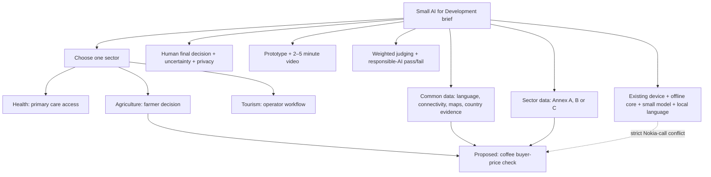
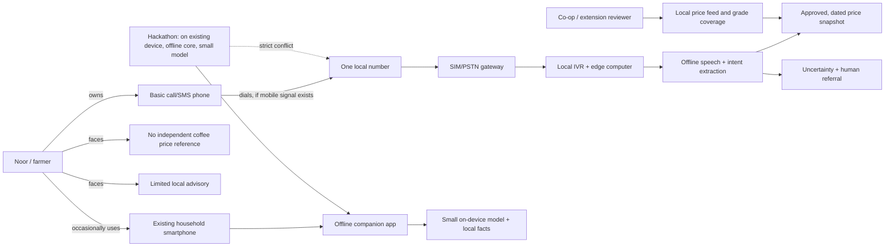

# Knowledge graph: hackathon brief and agriculture voice proposal

**Source:** the 2026 Small AI for Development Hackathon concept note PDF. It is marked **Official Use Only**, so it is not included in this repository. Page numbers below refer to the PDF. [Machine-readable nodes and edges](knowledge_graph.json) distinguish source facts, user requests, engineering inferences, and proposals.

**Source coverage:** The graph includes all three sector choices, common and sector data, entry rules, deliverables, judging and dates. **Proposed solution scope:** Agriculture, specifically Noor's coffee price decision. The sector, pilot country, district, and local language still need confirmation. Noor's situation is a fictional scenario in the brief, not a named deployment site (pp. 5–6).

**Judging map (PDF pp. 10–11):** Small AI fidelity 25%; development relevance 20%; data grounding 15%; evidence it works 15%; clarity/design/inclusivity and AI value 15%; scalability 10%. Responsible AI, data and safety are a pass/fail gate. The competition is 3–4 October 2026; shortlist selection is 5–6 October; Ignite Talk is 21 October (pp. 4–5).

| Sector | Source problem and suitable workflow | Data and critical limit |
|---|---|---|
| Health (Annex A, pp. 13–15) | Scarce clinician time, travel and records; support access, referral or documentation | Service Delivery Indicators, facility maps, DHS/SPA and DHIS2 are candidates. Patient data, bias and safety require strong controls. |
| **Agriculture (Annex B, pp. 16–17)** | Yield uncertainty, scarce extension and no independent buyer-price reference; this proposal chooses a price-check decision | WFP/FAOSTAT, crop images and weather are candidates. A current, grade-matched local coffee price feed and trusted cooperative are still missing. |
| Tourism (Annex C, pp. 19–20) | Weak discoverability, multilingual enquiries, bookings and review insight | OSM, Wikivoyage, Yelp, MASSIVE and FLORES/NLLB are candidates. Listing and operator skills remain preconditions. |

## Proposed solution subgraph

## Source-to-design evidence graph

| Claim / node | Relationship | Evidence or status |
|---|---|---|
| Noor has a call/SMS phone and sometimes uses her daughter's smartphone | `farmer → owns/uses → devices` | PDF p. 5 |
| The brief offers health, agriculture and tourism; an entry selects one | `brief → offers → sectors → selects → one sector` | PDF pp. 3, 6, 13–20 |
| Data has a common layer and a sector-specific layer | `brief → uses → both data layers` | PDF pp. 7–10 |
| Agriculture problems include slipped coffee yields, rare extension visits, and an unverified buyer price | `farmer → faces → advice/price gap` | PDF pp. 6, 16 |
| Entries choose one sector | `solution → belongs_to → agriculture` | PDF pp. 3, 6 |
| The tool runs on an existing device; its core works offline; models are transferable over weak links | `prototype → must_satisfy → device/offline/size` | PDF p. 7; offline meaning clarified on p. 11 |
| One interaction uses a named local language; human makes the final decision; uncertainty is flagged | `interaction → must_satisfy → language/guardrails` | PDF pp. 7, 11 |
| A working prototype and 2–5 minute video are required | `submission → includes → prototype/video` | PDF p. 10 |
| One phone number with no paid cloud AI | `requested_channel → constrains → architecture` | User request |
| Call audio can be processed by a local gateway and edge computer without an AI API | `gateway → routes_to → local AI` | Proposed architecture; needs a real telecom test |
| A live call still needs mobile voice coverage and has carrier costs | `call → depends_on → carrier` | Engineering inference; verify country and carrier terms |
| A Nokia feature phone cannot run the proposed speech pipeline itself | `basic handset → cannot_host → proposed model` | Engineering inference; verify exact model if on-device operation is claimed |
| A phone line alone fails the brief's strict on-device/offline reading | `voice line → conflicts_with → offline/on-user-device` | Inference from PDF pp. 7, 11; must be disclosed to judges |
| WFP/FAOSTAT are possible context sources but do not establish a local coffee parchment price | `candidate dataset → does_not_guarantee → local price` | PDF p. 17 lists candidates; local feed is an unresolved data gap |

## Dependency and decision chain

1. Confirm **country, district, target users, local language, and the exact feature phone**. These decide number availability, speech model, carrier cost, and dataset relevance.
2. Confirm a **cooperative or market partner** who can provide a dated price record with grade, unit, location, source, and permission to use it. A national or staple-food price is not a substitute for this.
3. Demonstrate the **offline app on the household's existing smartphone** as the hackathon core. Keep the same intent and response logic usable by the local phone gateway for the Nokia access path.
4. Treat the **one-number voice line as a separate deployment channel**. Prove it with a real feature-phone-to-gateway call if hardware and carrier access are available; a SIP-only simulator establishes software logic but does not establish Nokia reachability.
5. If speech confidence, price freshness, grade, or coverage is insufficient, respond with **“I am not sure; check with the cooperative”** and offer DTMF/human referral. The farmer decides whether to sell.

## Open nodes

| ID | Decision needed | Owner / acceptance evidence |
|---|---|---|
| O1 | Pilot geography and named local language | Product lead; country/district/language written in demo script |
| O2 | Price feed and permitted use | Data lead; one real sourced record or explicitly synthetic fixture with metadata |
| O3 | Carrier route and exact gateway hardware | Telecom lead; inbound call from basic handset demonstrated |
| O4 | Small model selection and actual offline footprint | ML lead; measured installed size and airplane-mode run |
| O5 | Judge interpretation of on-device rule | Submission lead; conflict explained plainly in video and write-up |

See [HANDOVER.md](HANDOVER.md) for the build plan, cost model, acceptance tests, and demo flow.
