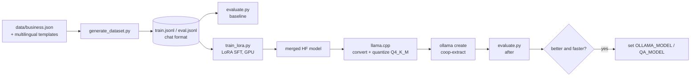

# Fine-tuning the small models

The assistant uses two LLM calls, both through Ollama:

| Task | Today | What fine-tuning should buy |
|---|---|---|
| **extract**: turn a caller's sentence (any of 5 languages) into `intent, quote, currency, unit, product_form, grade, district` | `qwen2.5:3b`, zero-shot, JSON schema | A 1–1.5B model with the same accuracy, so a turn takes about half the time and fits a phone later |
| **qa**: answer from `data/business.json` or say `found: false` | `gemma3:4b`, zero-shot, JSON schema | Fewer false "not found", fewer invented details, shorter spoken answers |

> **Status:** the dataset generator and the evaluation run in this repo. The LoRA training script is written but **has not been run yet**: there was no GPU on the build machine. No fine-tuned weights are published.

## Pipeline



## 1. Build the dataset

```bash
pip install -e .
python finetune/generate_dataset.py --per-template 20 --seed 7
```

Labels are generated by code, never by a model:

- **extract**: 12 sentence templates (2–4 per language: English, Hindi, Swahili, Chinese, Korean) filled with random prices, grades and districts. Nyeri sometimes appears in local script (न्येरी, 涅里, 니에리). The set also covers requests for a person, out-of-scope questions, missing grade and "per bag" units.
- **qa**: 25 question phrasings whose answers are built from `business.json` fields, plus 6 questions the profile cannot answer (`found: false`).
- The system prompts are imported from `coop_assistant.nlu`, so training and serving always use the same prompts.

Output (seed 7): **240 train / 43 eval** rows in `finetune/data/`.

## 2. Measure the baseline

```bash
python finetune/evaluate.py --extract-model qwen2.5:3b --qa-model gemma3:4b
```

The evaluation scores outputs after the app's own `normalize()` step, so it measures what the product would actually do. Results and every failure go to `finetune/results/*.json`.

**Baseline on the 43-row eval set (laptop CPU, no GPU):**

| Task | Model | Samples | Metric | Result | Avg time |
|---|---|---|---|---|---|
| extract | `qwen2.5:3b` | 37 | intent accuracy | **100%** | 7.8 s |
| extract | `qwen2.5:3b` | 37 | exact match, all slots | **81.1%** (30/37) | |
| qa | `gemma3:4b` | 6 | found / not-found accuracy | **100%** | 21.2 s* |
| qa | `gemma3:4b` | 6 | answers using only profile numbers | **100%** | |

\* This run includes loading the model into memory; a warm model answers in 5–15 s.

All 7 extraction failures fall into two patterns, and both are what fine-tuning should fix:

1. **Filling in details nobody said**: it outputs `currency: KES` (5 cases) or a unit (1 case) when the caller gave neither.
2. **Swahili vocabulary**: *matunda ya kahawa* (coffee cherries) was not recognised as `cherry` (3 cases).

## 3. Train (GPU)

```bash
pip install -e ".[finetune]"
python finetune/train_lora.py --config finetune/configs/qwen2.5-1.5b-lora.json
# or: --config finetune/configs/gemma3-1b-lora.json
```

| Setting | Value |
|---|---|
| Method | LoRA (PEFT) supervised fine-tuning with TRL `SFTTrainer` |
| Target modules | q, k, v, o, gate, up, down projections |
| Rank / alpha / dropout | 16 / 32 / 0.05 |
| Epochs / LR / schedule | 3 / 2e-4 / cosine, 5% warm-up |
| Effective batch | 4 × 4 gradient accumulation |
| Precision | bf16 where supported, else fp16 |

A free Colab T4 is enough for 1–1.5B models with this setup.

## 4. Export to Ollama

```bash
git clone https://github.com/ggml-org/llama.cpp
python llama.cpp/convert_hf_to_gguf.py finetune/outputs/qwen2.5-1.5b-coop-lora/merged \
       --outfile finetune/outputs/coop-qwen2.5-1.5b-f16.gguf
llama.cpp/build/bin/llama-quantize finetune/outputs/coop-qwen2.5-1.5b-f16.gguf \
       finetune/outputs/coop-qwen2.5-1.5b-q4_k_m.gguf Q4_K_M
ollama create coop-extract -f finetune/Modelfile
```

## 5. Compare and switch

```bash
python finetune/evaluate.py --extract-model coop-extract --qa-model gemma3:4b
set OLLAMA_MODEL=coop-extract        # Windows (PowerShell: $env:OLLAMA_MODEL="coop-extract")
```

Only switch if exact match is at least as good as the baseline **and** the average time per turn drops.

## Known gaps in the data

- The Q&A rows are English only. Multilingual Q&A needs phrasings and answers checked by native speakers, not machine translation.
- The templates are synthetic. Before a pilot, add consented, anonymised transcripts of real callers, especially Swahili.
- Prices and the business profile are demo data.
